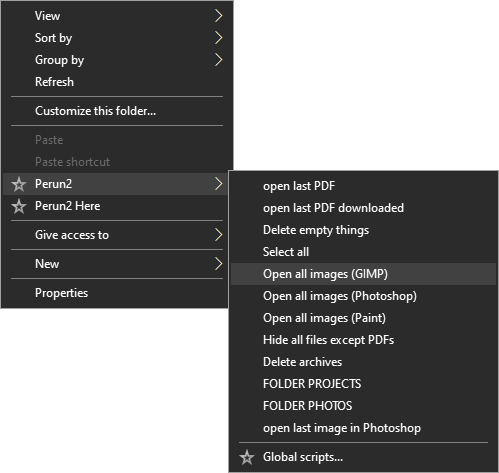

# Perun2

Perun2 is a statically typed scripting language for the file system. 
Together with its GUI applications, it enables creation of tiny programs runnable from the context menu of the File Explorer.

## Repository

This repository contains source code of the main executable file of Perun2.
It is named *perun2.exe* in the installation folder.
The source code of the remaining GUI applications of this project is [here](https://github.com/wojfil/perun2-gui).

## Documentation

The documentation is hosted at [this website](https://perun2.org/docs).

## Contribution

Perun2 is currently developed by WojFil Games.
Rules for external contributions are not specified yet.
However, you can help the development by suggesting new features.

## Build

What is required? 
Generally, you need CMake 3.10 and any version of GCC that fully supports at least C++14.
Source code will adjust to your version of C++ and with C++17 all possible optimizations are turned on.
For Windows OS, the *MinGW Makefiles* generator is used.
First of all, prepare all necessary dependencies from [external](external).
To build this project, select a proper batch script from [here](src/build) and run it. 
A file *perun2.exe* located there is the output.

## Versions

Version 0.9 will provide eternal backward compatibility.
Version 1.0 will be ready for production.

## License

Perun2 is licensed under [GNU General Public License v3.0](LICENSE.txt).

## Install

If you want to install Perun2 as a user, follow [quick guide](https://perun2.org/docs/quickguide).
