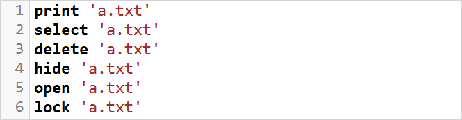

# Uroboros

Uroboros is a statically-typed and domain-specific scripting language. 
Inspired by SQL, it provides a readable interface for the most common file system operations.

## Repository

This repository contains source code of the main Uroboros file.
It uses command-line interface and is named 'uro.exe' in the installation folder.
Remaining 3 GUI applications of the project are [here](https://github.com/wojfil/uroboros-gui-win3264).

## Documentation

The documentation is hosted at [this website](https://uroboros-lang.org/docs).

## Build

Uroboros is compiled with GCC 11.2.0. Project does not use Boost nor other dependencies.
There are currently two possibilities for build: file 'Makefile' (GNU Make) or file 'Uroboros.cbp' (Code::Blocks build settings).
Maybe a CMake build alternative will be added soon. If you want to contribute to the project, please read [this](CONTRIBUTING.md).

## License

Uroboros is licensed under [GNU General Public License v3.0](LICENSE.txt).

## Install

If you want to install Uroboros as user, follow [quick guide](https://uroboros-lang.org/docs/quickguide).
