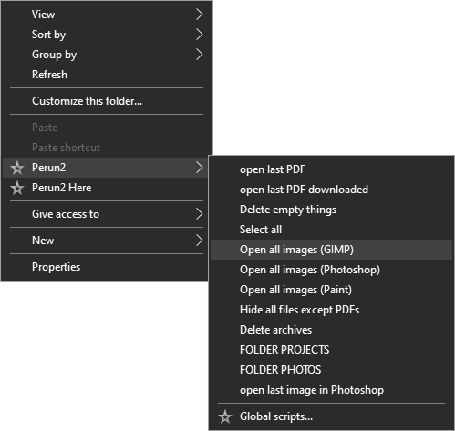

# Perun2

Perun2 is a statically typed scripting language for the file system. 
Together with its GUI applications, it enables creation of tiny programs runnable from the context menu of the File Explorer.

## Repository

This repository contains the source code of the main executable file of Perun2.
It is named *perun2.exe* in the installation folder.
The source code of the remaining GUI applications of this project is [here](https://github.com/wojfil/perun2-gui).

## Documentation

The documentation is hosted at [this website](https://perun2.org/docs).

## Contribution

Perun2 is currently developed by WojFil Games.
Rules for external contributions have not been specified yet.
However, you can help the development by suggesting new features.

## Build

What is required? 
Generally, you need CMake 3.10 and any version of GCC that fully supports at least C++17.
For Windows OS, the *MinGW Makefiles* generator is used.
Prepare all necessary dependencies from [external](external).
Then, take the batch script *windows cpp17.bat* from [here](src/build) and run it.
The file *perun2.exe* located there is the output.

## Versions

The version 0.9 will provide eternal backward compatibility.
The version 1.0 will be ready for production.

## License

Perun2 is licensed under [GNU General Public License v3.0](LICENSE.txt).

## Install

If you want to install Perun2 as user, follow [quick guide](https://perun2.org/docs/quickguide).
