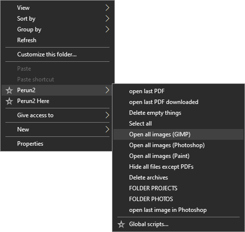

# Perun2

Perun2 is a statically typed scripting language for the file system. 
Together with its GUI applications, it enables creation of tiny programs runnable from the context menu of the File Explorer.

## Repository

This repository contains the source code of the main executable file of Perun2.
It is named *perun2.exe* in the installation folder.
The source code of the remaining GUI applications of this project is [here](https://github.com/wojfil/perun2-gui).

## Documentation

The documentation is hosted at [this website](https://perun2.org/docs).

## Contribution

Perun2 is currently developed by WojFil Games.
Rules for external contributions have not been specified yet.
However, you can help the development by suggesting new features.

## Build

This project requires CMake 3.21+, Visual Studio 2022 with C++ support, and vcpkg. The project uses C++17 and its dependencies (ICU and FFmpeg) are declared in *vcpkg.json*.

Set the VCPKG_ROOT environment variable to your vcpkg installation, then run the provided build script:
*.\scripts\all_win.bat*.
This script configures the project for Visual Studio 2022, x64 and builds the Release configuration. 
The resulting executable together with DLLs will appear in *.\build\src\Release*.

Final remark: the first compilation can take a very long time on Windows. 
It compiles the whole FFmpeg locally and it can even take 1 hour on cheap computers.

## Versions

The version 0.9 will provide eternal backward compatibility.
The version 1.0 will be ready for production.

## License

Perun2 is licensed under [GNU General Public License v3.0](LICENSE.txt).

## Install

If you want to install Perun2 as user, follow [quick guide](https://perun2.org/docs/quickguide).
